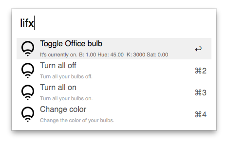

# LIFX Alfred Workflow

This workflow for [Alfred](http://www.alfredapp.com/) allowes you to control your [LIFX](http://lifx.co/) bulbs.

At the moment it is possible to turn on/off and change the color of a bulb.

Download the Workflow [here](https://github.com/stroebjo/alfred-lifx/releases/download/v1.0/LIFX.alfredworkflow).

